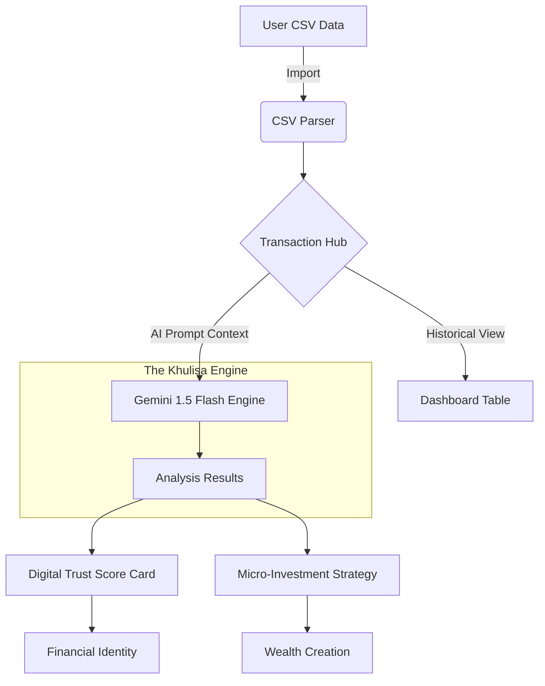

#  🇿🇦 Khulisa: Financial Growth for All

> *Empowering South Africa's informal economy with Digital Trust.*

## ⚡ Quick Start: How to Use
1. **Launch the Guided Tour**: Click the **"Start Guided Tour"** button at the top of the app for a step-by-step walkthrough.
2. **Import Sample Data**: If you don't have a CSV, use the **[khulisa_sample_transactions.csv](./public/khulisa_sample_transactions.csv)** provided in the public folder.
3. **Calculate AI Score**: Once transactions are loaded, click **"Calculate AI Score"** to see your digital trust rating.
4. **Start Growing**: Review your AI-generated **Growth Plan** and click **"Start Saving"** to begin your investment journey.

---

## 🏆 Project Pitch: The Vision
**Khulisa** (meaning "To Grow") is an AI-powered financial empowerment platform designed for South Africa's informal economy. 

**The Challenge:** Millions of South Africans operate in the informal sector, earning and spending through fragmented digital channels (MoMo, airtime, small bank transfers). Because this data isn't "centralized," these individuals are often excluded from formal credit and investment opportunities.

**The Solution:** Khulisa bridges the gap. By allowing users to import their transaction history, we use **Google Gemini 1.5 Flash** to perform deep behavioral analysis. We transform raw spending data into a **Digital Trust Score** and a personalized **Micro-Investment Path**, turning a simple CSV of history into a bridge to formal wealth.

---

## 🏗️ Application Architecture & Workflow

---

## 🎨 The Khulisa Minimalist Design
Our platform follows the **Khulisa Modern Financial Minimalist** aesthetic:
- **Clarity**: Swiss-style grids for readability.
- **Strength**: Bold `tabular-nums` for significant financial figures.
- **Trust**: A professional palette of Indigo-600 and Emerald-600.

---

## 🚀 The Three-Step Growth Journey

| Step | Action | Objective |
| :--- | :--- | :--- |
| **01. Import** | `Upload CSV` | Securely import your MoMo or bank transaction history. |
| **02. Analyze** | `Calculate AI Score` | Our Gemini AI calculates your Trust Score (0-1000). |
| **03. Invest** | `Start Saving` | Receive micro-investment recommendations tailored to your surplus. |

---

## 📁 Documentation Hub

- 📖 [**User Guide**](./docs/USER_GUIDE.md) - Mastering your financial dashboard.
- ⚙️ [**Technical Spec**](./docs/TECHNICAL_SPEC.md) - Tech stack & AI prompt logic.
- 💎 [**Brand Guidelines**](./docs/BRAND.md) - Colors, typography, and philosophy.

---

## 🛠️ Built for Impact
- **Intelligence**: Google Gemini 1.5 Pro/Flash integration.
- **Performance**: React 18 + Vite with zero HMR lag.
- **Localized**: Full Support for English, isiZulu, isiXhosa, and Afrikaans.
